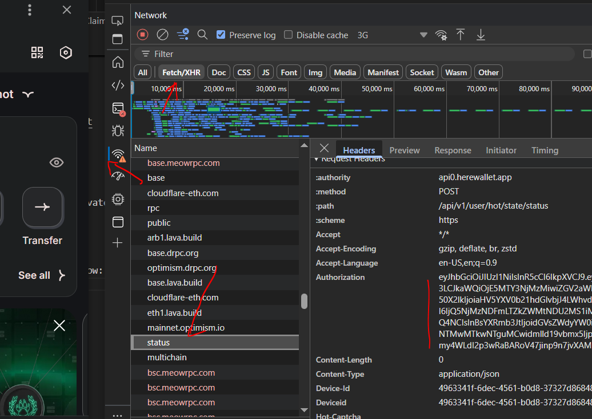

# ᝰ.ᐟ Hot Auto Claim

Tool được phát triển bởi nhóm tele Airdrop Hunter Siêu Tốc (https://t.me/airdrophuntersieutoc)

## 🚨 Attention Before Running Cli Version

I am not `responsible` for the possibility of an account being `banned`!

## 📎 Node cli version Script features

- Auto claim off chain
- Auto claim on chain
- Support proxy or not
- Mutiple threads, multiple accounts

## ✎ᝰ. RUNNING

- Install Dependency

```bash
npm install
```

- Setup config in .env

```bash
nano .env
```

- Setup input value

* proxy: http://user:pass@ip:port

```bash
nano proxy.txt
```

- data.txt save data fomat: private_key_near|bearer_token.

```bash
nano data.txt
```

How to get bearer_token, see below: (F12 => tab network => header)



- Run the script

```bash
node main.js
```
